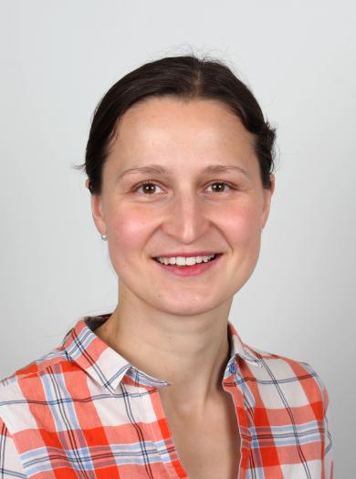
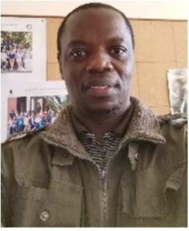

## DSI-Africa Training Programme: Climate Change, Food System and Remote Sensing Short Course 

#### Dates: Monday 10th July- Friday 21st July 2023

##### Venue: [Garden Court, Umhlanga,](https://www.southernsun.com/garden-court-umhlanga) Corner of Aurora Drive and Centenary Boulevard, Umhlanga Rocks, Kwazulu-Natal, South Africa.

##### Please use the following link: [ZOOM LINK](link will be provided later).

#### Lectures Schedule 

##### Week 1:

<table class="tg">
<thead>
  <tr>
    <th class="tg-amwm">Time</th>
    <th class="tg-amwm">Monday 10/07</th>
    <th class="tg-amwm">Tuesday 11/07</th>
    <th class="tg-amwm">Wednesday 12/07</th>
    <th class="tg-amwm">Thursday 13/07</th>
    <th class="tg-amwm">Friday 14/07</th>
   
  </tr>
</thead>
<tbody>
  <tr>
    <td class="tg-amwm">9:00-10:30 am</td>
    <td class="tg-0lax"> 1.Welcome and overview of course   
       2.Introduction to concepts and indicators: Climate change and weather </td>
    <td class="tg-0lax"> Definition  and History of Remote Sensing </td>
    <td class="tg-0lax"> Satellite image pre-processing </td>
    <td class="tg-0lax">Introduction to concepts and indicators: Food Systems </td>
    <td class="tg-0lax"> Self-Study: Massive Open Online Course on Research Methods for the study of Climate Change and Health </td>
    
  </tr>
  <tr>
    <td class="tg-amwm">10:30-10:45 am</td>
    <td class="tg-0lax">Break</td>
    <td class="tg-0lax">Break</td>
    <td class="tg-0lax">Break</td>
    <td class="tg-0lax">Break</td>
    <td class="tg-0lax">Break</td>
    
  </tr>
  <tr>
    <td class="tg-amwm">10:45-12:00 pm</td>
    <td class="tg-0lax"> Practical: Using public databases for climate change and weather </td>
    <td class="tg-0lax"> Energy interactions with  objectives</td>
    <td class="tg-0lax"> Unsupervised Image Classification </td>
    <td class="tg-0lax"> Practical: Interpret country profiles of the Food Systems Dashboard </td>
    <td class="tg-0lax">Self-Study: Massive Open Online Course on Research Methods for the study of Climate Change and Health</td>
    
  </tr>
  <tr>
    <td class="tg-amwm">12:00-1:00 pm</td>
    <td class="tg-0lax">Lunch</td>
    <td class="tg-0lax">Lunch</td>
    <td class="tg-0lax">Lunch</td>
    <td class="tg-0lax">Lunch</td>
    <td class="tg-0lax">Lunch</td>
    
  </tr>
  
  <tr>
    <td class="tg-amwm">1:00-2:15 pm</td>
    <td class="tg-0lax">Introduction to concepts and indicators: Environmental footprints of foods </td>
    <td class="tg-0lax"> Sensors and Platforms </td>
    <td class="tg-0lax"> Supervised Image Classification </td>
    <td class="tg-0lax"> Introduction to concepts and indicators: Nutritional status and Dietary Behaviours </td>
    <td class="tg-0lax">Self-Study: Massive Open Online Course on Research Methods for the study of Climate Change and Health</td>
    
  </tr>
  <tr>
    <td class="tg-amwm">2:15-2:30 pm</td>
    <td class="tg-0lax">Break</td>
    <td class="tg-0lax">Break</td>
    <td class="tg-0lax">Break</td>
    <td class="tg-0lax">Break</td>
    <td class="tg-0lax">Break</td>
    
  </tr>
  <tr>
    <td class="tg-amwm">2:30-3:45 pm</td>
    <td class="tg-0lax">Practical: Using public databases for life-cycle assessment of foods </td>
    <td class="tg-0lax"> Resolutions in remote sensing </td>
    <td class="tg-0lax">Supervised Image Classification (Cont'd)</td>
    <td class="tg-0lax"> Practical: How to compute overall diet quality indicators </td>
    <td class="tg-0lax"> Self-Study: Massive Open Online Course on Research Methods for the study of Climate Change and Health </td>
    
  </tr>
</tbody>
</table>

#### Week 2:

<table class="tg">
<thead>
  <tr>
    <th class="tg-amwm">Time</th>
    <th class="tg-amwm">Monday 17/07</th>
    <th class="tg-amwm">Tuesday 18/07</th>
    <th class="tg-amwm">Wednesday 19/07</th>
    <th class="tg-amwm">Thursday 20/07</th>
    <th class="tg-amwm">Friday 21/07</th>
  </tr>
</thead>
<tbody>
  <tr>
    <td class="tg-amwm">9:00-10:30 am</td>
    <td class="tg-0lax"> Methodological challenges-Identifying the impacts of climate change on dietary habits and nutritional status </td>
    <td class="tg-0lax">Drive solutions for climate change adaptation-Examples of intervention project.   Practical example: MEGA in Dodoma </td>
    <td class="tg-0lax"> Presentation of own research ideas and methodological challenges; selecting 4 project ideas to be worked on</td>
    <td class="tg-0lax"> Creating Map Outputs</td>
    <td class="tg-0lax"> Supervised Classification  Cont'd. </td>
  </tr>
  <tr>
    <td class="tg-amwm">10:30-10:45 am</td>
    <td class="tg-0lax">Break</td>
    <td class="tg-0lax">Break</td>
    <td class="tg-0lax">Break</td>
    <td class="tg-0lax">Break</td>
    <td class="tg-0lax">Break</td>
  </tr>
  <tr>
    <td class="tg-amwm">10:45-12:00 pm</td>
    <td class="tg-0lax"> Methodological Solutions - Dimension reduction techniques to identify climate change impacts </td>
    <td class="tg-0lax"> Practical Example: Linear optimization modelling for sustainable diets among Ghanaian migrants</td>
    <td class="tg-0lax">Tutored group work to derive methodological solutions for 4 project ideas</td>
    <td class="tg-0lax"> Handling remotely sensed data in QGIS</td>
    <td class="tg-0lax"> Introduction and Calculation of Vegetation Indices </td>
  </tr>
  <tr>
    <td class="tg-amwm">12:00-1:00 pm</td>
    <td class="tg-0lax">Lunch</td>
    <td class="tg-0lax">Lunch</td>
    <td class="tg-0lax">Lunch</td>
    <td class="tg-0lax">Lunch</td>
    <td class="tg-0lax">Lunch</td>
  </tr>
  <tr> 
    <td class="tg-amwm">1:00-2:15 pm</td>
    <td class="tg-0lax"> Methodological Solutions- Machine learning approaches to identify climate change impacts </td>
    <td class="tg-0lax"> Derive solutions for climate change mitigation - Optimization modelling and substitution approaches for sustainable diets.   
    Sustainable dietary weight loss approach </td>
    <td class="tg-0lax">Introduction to QGIS</td>
    <td class="tg-0lax">Unspervised Classification </td>
    <td class="tg-0lax">Synthesis (recap) and Course Evaluation</td>
  </tr>
  <tr>
    <td class="tg-amwm">2:15-2:30 pm</td>
    <td class="tg-0lax">Break</td>
    <td class="tg-0lax">Break</td>
    <td class="tg-0lax">Break</td>
    <td class="tg-0lax">Break</td>
    <td class="tg-0lax">Break</td>
  </tr>
  <tr> 
    <td class="tg-amwm">2:30-3:45 pm</td>
    <td class="tg-0lax">Methodological Solutions- Down-scaled climate change impacts models</td>
    <td class="tg-0lax"> TBD Session</td>
    <td class="tg-0lax"> Spatial data entry and preparation </td>
    <td class="tg-0lax"> Supervised Classification </td>
    <td class="tg-0lax">Closing Ceremony</td>
  </tr>
</tbody>
</table>

### Course Facilitators

<table class="tg">
<thead>
  <tr>
    <th class="tg-amwm">Role</th>
    <th class="tg-amwm">Name</th>
    <th class="tg-amwm">Email</th>
    <th class="tg-amwm">Brief Bio</th>
    <th class="tg-amwm"></th>
  </tr>
</thead>
<tbody>
  <tr>
    <td class="tg-0lax">Lead Facilitator </td>
    <td class="tg-0lax">Prof.  Wafaie Fawzi,
Professor of Population Sciences, and Professor of Nutrition, Epidemiology, and Global Health, PI HSPH</td>
    <td class="tg-0lax"><a href="mailto:mina@hsph.harvard.edu"> mina@hsph.harvard.edu</a> </td>
    <td class="tg-0lax"> Wafaie Fawzi’s research has generated significant new knowledge on the discovery and translation of interventions to enhance maternal and child health and human development, with emphasis on nutritional factors. His research includes the epidemiology of adverse pregnancy outcomes, childhood infections, and HIV, TB and malaria. He established the Nutrition and Global Health Program at Harvard T.H. Chan School of Public Health, that addresses and documents existing gaps; advances the research agenda; and convenes multi-disciplinary partners. He also developed two implementation science initiatives to advance adolescent health in Africa and Asia, and the intersectoral integration of agriculture, nutrition and health in Ethiopia and Tanzania. He established the Africa Research, Implementation Science, and Education (ARISE) Network, a partnership of leading academic institutions in Africa, and the China Harvard Africa Network (CHAN) to advance cutting-edge training of public health leaders through South-South-North institutional partnerships.
 </td>
    <td class="tg-0lax"></td>
  </tr>
  <tr>
    <td class="tg-0lax">Lead Facilitator</td>
    <td class="tg-0lax">Prof. Ina Danquah, Heidelberg Institute of Global Health </td>
    <td class="tg-0lax"><a href="mailto:ina.danquah@uni-heidelberg.de">ina.danquah@uni-heidelberg.de</a> </td>
    <td class="tg-0lax">Ina has trained in nutrition science and epidemiology and has obtained her PhD in Tropical Medicine from Charité – Universitaetsmedizin Berlin, Germany. She has strong research interests in dietary risk factors for infectious diseases, obesity and type 2 diabetes, particularly among African populations under transition. Ina leads a research group on climate change, nutrition and health with the ambition i) to define impacts on dietary habits and nutritional status, ii) to design, implement and evaluate climate change adaptation strategies, and iii) to determine the health co-benefits of climate change mitigation actions. Ina coordinates a large consortium on climate change and health in sub-Saharan Africa, and is Robert Bosch Junior Professor for Sustainable Nutrition in sub-Saharan Africa. She has published more than 90 peer-reviewed articles, has an h-index of 23 and an i10-index of 45. Her work has been cited more than 2100 times.</td>
    <td class="tg-0lax"></td>
  </tr>
  <tr>
    <td class="tg-0lax">Lead Facilitator</td>
    <td class="tg-0lax">Prof. John Odindi, University of KwaZulu-Natal</td>
    <td class="tg-0lax"><a href="mailto:odindij@ukzn.ac.za">odindij@ukzn.ac.za</a> </td>
    <td class="tg-0lax">John Odindi is a professor of terrestrial remote sensing within the School of Agricultural, Earth and Environmental Sciences at the University of KwaZulu-Natal. His expertise are in vegetation pattern and condition analysis in the face of local and global change using remotely sensed datasets and approaches. He integrates ecology, biodiversity conservation and Remote sensing to model the impact of landscape transformation and invasive species on ecosystems. He is also interested in understanding the implication of urban green spaces on urban thermal micro- and macro climate in the face of climate change using optical and thermal remotely sensed data. His specific areas of interest include land use and land cover change, hyperspectral- and multi- spectral Remote Sensing of vegetation, urban green ecology in a changing global climate, quantification of urban ecosystem services using remotely sensed data and precision farming using hyper and multi-spectral data from aerial and satellite platforms.</td>
    <td class="tg-0lax"></td>
  </tr>
  <tr>
    <td class="tg-0lax">Lead Facilitator</td>
    <td class="tg-0lax">Prof. Onisimo Mutanga, University of KwaZulu-Natal</td>
    <td class="tg-0lax"><a href="mailto:mutangao@ukzn.ac.za">mutangao@ukzn.ac.za</a> </td>
    <td class="tg-0lax">Onisimo Mutanga is full Professor of Remote Sensing and SARChI Chair in Landuse Planning and Management in the School of Agriculture, Earth and Environmental Science at the University of KwaZulu- Natal. His expertise lies in resource modelling, and pattern and condition analysis in the face of global and land use change. These include vegetation quality and quantity assessment in both space and time using remote sensing for grazing resource management and climate change mitigation. He integrates ecology, biodiversity conservation and remote sensing to model, among others, the impact of forest fragmentation, pests and diseases and invasive species on ecosystems as an integral component of land use planning and management.</td>
    <td class="tg-0lax"></td>
  </tr>
   <tr>
    <td class="tg-0lax">Facilitator</td>
    <td class="tg-0lax">Dr. Isabel Madzorera </td>
    <td class="tg-0lax"><a href="mailto:imadzorera@berkeley.edu">imadzorera@berkeley.edu</a> </td>
    <td class="tg-0lax">Dr. Isabel Madzorera is an Assistant Professor in Public Health Nutrition at the University of California, Berkeley, in the division of Community Health Sciences. Dr. Madzorera is a nutrition epidemiologist with interests in the intersection of food systems, nutrition and sustainable diets in low- and middle-income countries (LMICs). The goals of her research program are to utilize advanced nutrition epidemiologic methods to assess diet quality as a key modifiable risk factor for poor maternal and child health outcomes in LMICs, and to identify the role of food systems and other contributing factors to the triple burden of malnutrition in these contexts. Dr. Madzorera has led global health research focusing on the evaluation of food systems and diet quality, and their influence on maternal and child health.  Her previous research has included evaluating the role of maternal diet quality during pregnancy and its impacts on the risk of low birth weight, small for gestational age and preterm births, and also assessing the effect of COVID-19 on food prices and diets. Dr. Madzorera has extensive field-based experience including leading maternal and child nutrition interventions in sub-Saharan Africa. She has spent considerable time working in Zimbabwe, Zambia, Malawi, and Mozambique and conducted research in Tanzania and Ethiopia. Dr. Madzorera has an ScD in Nutritional Epidemiology from the Harvard School of Public Health. 
 </td>
    <td class="tg-0lax"></td>
  </tr>
   <tr>
    <td class="tg-0lax">Facilitator</td>
    <td class="tg-0lax">Dr. Trylee Matongera </td>
    <td class="tg-0lax"><a href="mailto:matongerat@ukzn.ac.za">matongerat@ukzn.ac.za</a> </td>
    <td class="tg-0lax">Trylee Matongera is a Postdoctoral Research Fellow at the Centre for Transformative Agriculture and Food Systems at the University of KwaZulu-Natal. His research interests lie in applying advanced machine learning and remote sensing techniques to better understand crop growth patterns and to develop more effective and efficient precision agriculture technologies. Specifically, he is interested in exploring the use of hyperspectral, LIDAR and multispectral imagery to detect and monitor crop health and nutrient deficiencies, as well as the use of unmanned aerial vehicles (UAVs) for precision mapping and monitoring of crops and agricultural fields. </td>
    <td class="tg-0lax"></td>
  </tr>
  
  <tr>
    <td class="tg-0lax">Facilitator</td>
    <td class="tg-0lax">Dr. Trylee Matongera </td>
    <td class="tg-0lax"><a href="mailto:matongerat@ukzn.ac.za">matongerat@ukzn.ac.za</a> </td>
    <td class="tg-0lax">Trylee Matongera is a Postdoctoral Research Fellow at the Centre for Transformative Agriculture and Food Systems at the University of KwaZulu-Natal. His research interests lie in applying advanced machine learning and remote sensing techniques to better understand crop growth patterns and to develop more effective and efficient precision agriculture technologies. Specifically, he is interested in exploring the use of hyperspectral, LIDAR and multispectral imagery to detect and monitor crop health and nutrient deficiencies, as well as the use of unmanned aerial vehicles (UAVs) for precision mapping and monitoring of crops and agricultural fields. </td>
    <td class="tg-0lax"></td>
  </tr>
  <tr>
    <td class="tg-0lax">Teaching Assistant</td>
    <td class="tg-0lax">Dr. Gabriel Kallah-Dagadu, DSI postdoc</td>
    <td class="tg-0lax"><a href="mailto:kallahdagadug@ukzn.ac.za">kallahdagadug@ukzn.ac.za</a> </td>
    <td class="tg-0lax">Gabriel Kallah-Dagadu holds a Ph.D. in Statistics from the University of Cape Coast, Ghana. Gabriel is Lecturer at the University of Ghana and has eight years of teaching and supervising experience in Statistics, Probability, and Data Science. He is currently a postdoctoral fellow in the DSI-Africa Training program on Health Data Science project hosted by the University of KwaZulu-Natal, South Africa, Harvard T. H. Chan School of Public Health, USA, and Heidelberg Institute of Global Health, Germany. His research interest are centered on applied probability, computational statistics, and machine learning with real-life applications to health, climate change, and finance. He has published scientific and peer-reviewed articles in local and international journals.</td>
    <td class="tg-0lax"></td>
  </tr>
  <tr>
    <td class="tg-0lax">Teaching Assistant</td>
    <td class="tg-0lax">Dr. Mohanad Mohammed, DSI postdoc</td>
    <td class="tg-0lax"><a href="mailto:mohammedm1@ukzn.ac.za">mohammedm1@ukzn.ac.za</a> </td>
    <td class="tg-0lax">Mohanad Mohammed earned his PhD from the School of Mathematics, Statistics, and Computer Science (SMSCS), specializing in Statistics at the University of KwaZulu-Natal (UKZN) in 2022. During his MSc and PhD studies, he worked as a tutor and an Adhoc lecturer in SMSCS at the same university, which continued from 2019 to 2022. He is currently a post-doc fellow working on a health data science project hosted by UKZN in collaboration with Harvard T. H. Chan, School of Public Health, USA, and Heidelberg University and Germany. His research has focused on developing and applying statistical methods in genomics, genetics, public health, and the environment. He is interested in contributing to a deeper understanding of cancer disease modeling using gene expression data to facilitate decision-making concerning diagnosis, treatment, and care. In addition, Mohammed has authored and co-authored many articles, ten of which have been published in reputable journals and conference papers. He has attended and presented at various international and local workshops and conferences and is an active member of the biostatistics team under the MASAMU program.</td>
    <td class="tg-0lax"></td>
  </tr>
</tbody>
</table>

