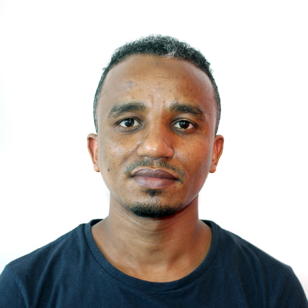

## DSI-Africa Training Programme: Climate Change, Food System and Remote Sensing

### Dates: Monday 10th July- Friday 21st July 2023
### Venue: [Garden Court, Umhlanga,](https://www.southernsun.com/garden-court-umhlanga) Corner of Aurora Drive and Centenary Boulevard, Umhlanga Rocks, Kwazulu-Natal, South Africa.

#### Please use the following link: [ZOOM LINK](link will be provided later).

### Lectures Schedule 

#### Week 1:

<table class="tg">
<thead>
  <tr>
    <th class="tg-amwm">Time</th>
    <th class="tg-amwm">Monday 10/07</th>
    <th class="tg-amwm">Tuesday 11/07</th>
    <th class="tg-amwm">Wednesday 12/07</th>
    <th class="tg-amwm">Thursday 13/07</th>
    <th class="tg-amwm">Friday 14/07</th>
   
  </tr>
</thead>
<tbody>
  <tr>
    <td class="tg-amwm">9:00-10:30 am</td>
    <td class="tg-0lax"> 1.Welcome and overview of course   
       2.Introduction to concepts and indicators: Climate change and weather </td>
    <td class="tg-0lax"> Definition  and History of Remote Sensing </td>
    <td class="tg-0lax"> Satellite image pre-processing </td>
    <td class="tg-0lax">Introduction to concepts and indicators: Food Systems </td>
    <td class="tg-0lax"> Self-Study: Massive Open Online Course on Research Methods for the study of Climate Change and Health </td>
    
  </tr>
  <tr>
    <td class="tg-amwm">10:30-10:45 am</td>
    <td class="tg-0lax">Break</td>
    <td class="tg-0lax">Break</td>
    <td class="tg-0lax">Break</td>
    <td class="tg-0lax">Break</td>
    <td class="tg-0lax">Break</td>
    
  </tr>
  <tr>
    <td class="tg-amwm">10:45-12:00 pm</td>
    <td class="tg-0lax"> Practical: Using public databases for climate change and weather </td>
    <td class="tg-0lax"> Energy interactions with  objectives</td>
    <td class="tg-0lax"> Unsupervised Image Classification </td>
    <td class="tg-0lax"> Practical: Interpret country profiles of the Food Systems Dashboard </td>
    <td class="tg-0lax">Self-Study: Massive Open Online Course on Research Methods for the study of Climate Change and Health</td>
    
  </tr>
  <tr>
    <td class="tg-amwm">12:00-1:00 pm</td>
    <td class="tg-0lax">Lunch</td>
    <td class="tg-0lax">Lunch</td>
    <td class="tg-0lax">Lunch</td>
    <td class="tg-0lax">Lunch</td>
    <td class="tg-0lax">Lunch</td>
    
  </tr>
  
  <tr>
    <td class="tg-amwm">1:00-2:15 pm</td>
    <td class="tg-0lax">Introduction to concepts and indicators: Environmental footprints of foods </td>
    <td class="tg-0lax"> Sensors and Platforms </td>
    <td class="tg-0lax"> Supervised Image Classification </td>
    <td class="tg-0lax"> Introduction to concepts and indicators: Nutritional status and Dietary Behaviours </td>
    <td class="tg-0lax">Self-Study: Massive Open Online Course on Research Methods for the study of Climate Change and Health</td>
    
  </tr>
  <tr>
    <td class="tg-amwm">2:15-2:30 pm</td>
    <td class="tg-0lax">Break</td>
    <td class="tg-0lax">Break</td>
    <td class="tg-0lax">Break</td>
    <td class="tg-0lax">Break</td>
    <td class="tg-0lax">Break</td>
    
  </tr>
  <tr>
    <td class="tg-amwm">2:30-3:45 pm</td>
    <td class="tg-0lax">Practical: Using public databases for life-cycle assessment of foods </td>
    <td class="tg-0lax"> Resolutions in remote sensing </td>
    <td class="tg-0lax">Supervised Image Classification (Cont'd)</td>
    <td class="tg-0lax"> Practical: How to compute overall diet quality indicators </td>
    <td class="tg-0lax"> Self-Study: Massive Open Online Course on Research Methods for the study of Climate Change and Health </td>
    
  </tr>
</tbody>
</table>

#### Week 2:

<table class="tg">
<thead>
  <tr>
    <th class="tg-amwm">Time</th>
    <th class="tg-amwm">Monday 03/07</th>
    <th class="tg-amwm">Tuesday 04/07</th>
    <th class="tg-amwm">Wednesday 05/07</th>
    <th class="tg-amwm">Thursday 06/07</th>
    <th class="tg-amwm">Friday 07/07</th>
  </tr>
</thead>
<tbody>
  <tr>
    <td class="tg-amwm">9:00-10:30 am</td>
    <td class="tg-0lax"> Methodological challenges-Identifying the impacts of climate change on dietary habits and nutritional status </td>
    <td class="tg-0lax">Drive solutions for climate change adaptation-Examples of intervention project.   Practical example: MEGA in Dodoma </td>
    <td class="tg-0lax"> Presentation of own research ideas and methodological challenges; selecting 4 project ideas to be worked on</td>
    <td class="tg-0lax"> Creating Map Outputs</td>
    <td class="tg-0lax"> Supervised Classification  Cont'd. </td>
  </tr>
  <tr>
    <td class="tg-amwm">10:30-10:45 am</td>
    <td class="tg-0lax">Break</td>
    <td class="tg-0lax">Break</td>
    <td class="tg-0lax">Break</td>
    <td class="tg-0lax">Break</td>
    <td class="tg-0lax">Break</td>
  </tr>
  <tr>
    <td class="tg-amwm">10:45-12:00 pm</td>
    <td class="tg-0lax"> Methodological Solutions - Dimension reduction techniques to identify climate change impacts </td>
    <td class="tg-0lax"> Practical Example: Linear optimization modelling for sustainable diets among Ghanaian migrants</td>
    <td class="tg-0lax">Tutored group work to derive methodological solutions for 4 project ideas</td>
    <td class="tg-0lax"> Handling remotely sensed data in QGIS</td>
    <td class="tg-0lax"> Introduction and Calculation of Vegetation Indices </td>
  </tr>
  <tr>
    <td class="tg-amwm">12:00-1:00 pm</td>
    <td class="tg-0lax">Lunch</td>
    <td class="tg-0lax">Lunch</td>
    <td class="tg-0lax">Lunch</td>
    <td class="tg-0lax">Lunch</td>
    <td class="tg-0lax">Lunch</td>
  </tr>
  <tr> 
    <td class="tg-amwm">1:00-2:15 pm</td>
    <td class="tg-0lax"> Methodological Solutions- Machine learning approaches to identify climate change impacts </td>
    <td class="tg-0lax"> Derive solutions for climate change mitigation - Optimization modelling and substitution approaches for sustainable diets.   
    Sustainable dietary weight loss approach </td>
    <td class="tg-0lax">Introduction to QGIS</td>
    <td class="tg-0lax">Unspervised Classification </td>
    <td class="tg-0lax">Synthesis (recap) and Course Evaluation</td>
  </tr>
  <tr>
    <td class="tg-amwm">2:15-2:30 pm</td>
    <td class="tg-0lax">Break</td>
    <td class="tg-0lax">Break</td>
    <td class="tg-0lax">Break</td>
    <td class="tg-0lax">Break</td>
    <td class="tg-0lax">Break</td>
  </tr>
  <tr> 
    <td class="tg-amwm">2:30-3:45 pm</td>
    <td class="tg-0lax">Methodological Solutions- Down-scaled climate change impacts models</td>
    <td class="tg-0lax"> TBD Session</td>
    <td class="tg-0lax"> Spatial data entry and preparation </td>
    <td class="tg-0lax"> Supervised Classification </td>
    <td class="tg-0lax">Closing Ceremony</td>
  </tr>
</tbody>
</table>

### Course Facilitators

<table class="tg">
<thead>
  <tr>
    <th class="tg-amwm">Role</th>
    <th class="tg-amwm">Name</th>
    <th class="tg-amwm">Email</th>
    <th class="tg-amwm">Brief Bio</th>
    <th class="tg-amwm"></th>
  </tr>
</thead>
<tbody>
  <tr>
    <td class="tg-0lax">Lead Facilitator </td>
    <td class="tg-0lax">Prof.  Wafaie Fawzi,
Professor of Population Sciences, and Professor of Nutrition, Epidemiology, and Global Health, co-PI UKZN</td>
    <td class="tg-0lax"><a href="mailto:mina@hsph.harvard.edu"> mina@hsph.harvard.edu</a> </td>
    <td class="tg-0lax"> Wafaie Fawzi’s research has generated significant new knowledge on the discovery and translation of interventions to enhance maternal and child health and human development, with emphasis on nutritional factors. His research includes the epidemiology of adverse pregnancy outcomes, childhood infections, and HIV, TB and malaria. He established the Nutrition and Global Health Program at Harvard T.H. Chan School of Public Health, that addresses and documents existing gaps; advances the research agenda; and convenes multi-disciplinary partners. He also developed two implementation science initiatives to advance adolescent health in Africa and Asia, and the intersectoral integration of agriculture, nutrition and health in Ethiopia and Tanzania. He established the Africa Research, Implementation Science, and Education (ARISE) Network, a partnership of leading academic institutions in Africa, and the China Harvard Africa Network (CHAN) to advance cutting-edge training of public health leaders through South-South-North institutional partnerships.
 </td>
    <td class="tg-0lax"></td>
  </tr>
  <tr>
    <td class="tg-0lax">Lead Facilitator</td>
    <td class="tg-0lax">Dr. Santiago Romero-Brufau, Harvard T.H Chan School of Public Health</td>
    <td class="tg-0lax"><a href="mailto:santiagoromerobrufau@hsph.harvard.edu">santiagoromerobrufau@hsph.harvard.edu</a> </td>
    <td class="tg-0lax">Santiago Romero-Brufau MD, PhD has a background in Medicine, Healthcare Systems Engineering, Informatics and Health Data Science. He is Assistant Professor of Otorhinolaryngology, and Healthcare Systems Engineering at Mayo Clinic. He is also Adjunct Assistant Professor of Biostatistics at the Harvard T. H. Chan School of Public Health, where he serves in the executive committee and teaches two of the core courses in the Master’s in Health Data Science. Dr. Romero-Brufau’s work is centered on developing and implementing machine-learning models and other data science solutions into clinical practice. His focus is on real-world applications as well as how to integrate advanced solutions into the clinical workflow and bridging the gap between model development and clinical and public health impact.</td>
    <td class="tg-0lax"></td>
  </tr>
  <tr>
    <td class="tg-0lax">Co-lead Facilitator</td>
    <td class="tg-0lax">Dr. Sandra Barteit, Training Director, Heidelberg Institute of Global Health, Germany</td>
    <td class="tg-0lax"><a href="mailto:barteit@uni-heidelberg.de">barteit@uni-heidelberg.de</a> </td>
    <td class="tg-0lax">My enthusiasm for Global Health led me to join the Heidelberg University Institute of Global Health as a full-time researcher in 2015. Currently, amongst many other projects, I am leading a project that implements novel measurements of wearables in vulnerable populations in Kenya and Burkina Faso to conduct cutting-edge climate change and health research, which helpd us gain new insights into the disease burden in poor populations facing exposure to climate change, such as heat or droughts. Furthermore, I lead the Blended Learning in Zambia (BLiZ) project that implements blended learning to strengthen medical education at the largest medical University in Zambia. In my research, I apply a variety of analytics models and cross-cutting analytics modeling concepts and cases.</td>
    <td class="tg-0lax"></td>
  </tr>
  <tr>
    <td class="tg-0lax">Facilitator</td>
    <td class="tg-0lax">Dr. Palwasha Khan, Head of informatics at AHRI</td>
    <td class="tg-0lax"></td>
    <td class="tg-0lax">Palwasha Khan is a Clinical Associate Professor in Infectious Disease Epidemiology at London School of Hygiene &amp; Tropical Medicine and a clinical epidemiologist with Interactive Research &amp; Development primarily working at the clinical academia-implementation interface. She is currently seconded to the Africa Health Research Institute (AHRI) in Kwa-Zulu Natal as head of the Health Informatics section of the AHRI Data Science Unit.  Her research interests include combining field epidemiological studies and programmatic electronic health data to further understanding of Mycobacterium tuberculosis transmission at a population-level.</td>
    <td class="tg-0lax"></td>
  </tr>
  <tr>
    <td class="tg-0lax">Facilitator</td>
    <td class="tg-0lax">Dr. Mandlenkosi Gwetu</td>
    <td class="tg-0lax"><a href="mailto:Gwetum@ukzn.ac.za">Gwetum@ukzn.ac.za</a> </td>
    <td class="tg-0lax">Mandla Gwetu is a Computer Scientist with over 10 years of academic experience. He is also an alumnus of the Heidelberg Laureate Forum and holds a Doctoral Degree in Computer Science. He currently serves as the Academic Leader for Computer Science at UKZN. His research focus lies mainly in the computational aspects of computer vision and machine learning. He currently supervises several PhD &amp; MSc students in these areas. Mandla holds industry certifications in Java and AWS. He is an experienced reviewer of several Computer Science Journal and international conferences.</td>
    <td class="tg-0lax"></td>
  </tr>
  <tr>
    <td class="tg-0lax">Teaching Assistant</td>
    <td class="tg-0lax">Dr. Gabriel Kallah-Dagadu, DSI postdoc</td>
    <td class="tg-0lax"><a href="mailto:kallahdagadug@ukzn.ac.za">kallahdagadug@ukzn.ac.za</a> </td>
    <td class="tg-0lax">Gabriel Kallah-Dagadu holds a Ph.D. in Statistics from the University of Cape Coast, Ghana. Gabriel is Lecturer at the University of Ghana and has eight years of teaching and supervising experience in Statistics, Probability, and Data Science. He is currently a postdoctoral fellow in the DSI-Africa Training program on Health Data Science project hosted by the University of KwaZulu-Natal, South Africa, Harvard T. H. Chan School of Public Health, USA, and Heidelberg Institute of Global Health, Germany. His research interest are centered on applied probability, computational statistics, and machine learning with real-life applications to health, climate change, and finance. He has published scientific and peer-reviewed articles in local and international journals.</td>
    <td class="tg-0lax"></td>
  </tr>
  <tr>
    <td class="tg-0lax">Teaching Assistant</td>
    <td class="tg-0lax">Dr. Mohanad Mohammed, DSI postdoc</td>
    <td class="tg-0lax"><a href="mailto:mohammedm1@ukzn.ac.za">mohammedm1@ukzn.ac.za</a> </td>
    <td class="tg-0lax">Mohanad Mohammed earned his PhD from the School of Mathematics, Statistics, and Computer Science (SMSCS), specializing in Statistics at the University of KwaZulu-Natal (UKZN) in 2022. During his MSc and PhD studies, he worked as a tutor and an Adhoc lecturer in SMSCS at the same university, which continued from 2019 to 2022. He is currently a post-doc fellow working on a health data science project hosted by UKZN in collaboration with Harvard T. H. Chan, School of Public Health, USA, and Heidelberg University and Germany. His research has focused on developing and applying statistical methods in genomics, genetics, public health, and the environment. He is interested in contributing to a deeper understanding of cancer disease modeling using gene expression data to facilitate decision-making concerning diagnosis, treatment, and care. In addition, Mohammed has authored and co-authored many articles, ten of which have been published in reputable journals and conference papers. He has attended and presented at various international and local workshops and conferences and is an active member of the biostatistics team under the MASAMU program.</td>
    <td class="tg-0lax"></td>
  </tr>
</tbody>
</table>

