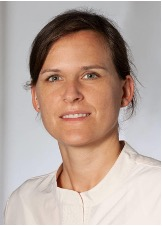
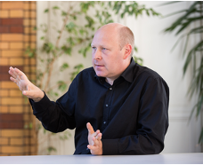

---
layout: page
title: Course Facilitators 
--- 

<h4 style="color:DodgerBlue;"> Prof. Wafaie W. Fawzi, Lead Facilitator and Principal Investigator, Harvard School of Public Health, USA </h4> 
Professor of Population Sciences, and Professor of Nutrition, Epidemiology, and Global Health.  
Email: <a href="mailto:mina@hsph.harvard.edu">mina@hsph.harvard.edu</a>  

  Wafaie Fawzi’s research has generated significant new knowledge on the discovery and translation of interventions to enhance maternal and child health and human development, with emphasis on nutritional factors. His research includes the epidemiology of adverse pregnancy outcomes, childhood infections, and HIV, TB and malaria. He established the Nutrition and Global Health Program at Harvard T.H. Chan School of Public Health, that addresses and documents existing gaps; advances the research agenda; and convenes multi-disciplinary partners. He also developed two implementation science initiatives to advance adolescent health in Africa and Asia, and the intersectoral integration of agriculture, nutrition and health in Ethiopia and Tanzania. He established the Africa Research, Implementation Science, and Education (ARISE) Network, a partnership of leading academic institutions in Africa, and the China Harvard Africa Network (CHAN) to advance cutting-edge training of public health leaders through South-South-North institutional partnerships.  Visit <a href="https://www.hsph.harvard.edu/wafaie-fawzi/">Prof. Wafaie's website</a> for more information about his work. 
  

<h4 style="color:DodgerBlue;"> Prof. Ina Danquah, Lead Facilitator   </h4>
Robert Bosch Junior Professor for Sustainable Nutrition in sub-Saharan Africa, Heidelberg Institute of Global Health, Germany.  
Email: <a href="mailto:ina.danquah@uni-heidelberg.de">ina.danquah@uni-heidelberg.de</a>  

  Ina has trained in nutrition science and epidemiology and has obtained her PhD in Tropical Medicine from Charité – Universitaetsmedizin Berlin, Germany. She has strong research interests in dietary risk factors for infectious diseases, obesity and type 2 diabetes, particularly among African populations under transition. Ina leads a research group on climate change, nutrition and health with the ambition i) to define impacts on dietary habits and nutritional status, ii) to design, implement and evaluate climate change adaptation strategies, and iii) to determine the health co-benefits of climate change mitigation actions. Ina coordinates a large consortium on climate change and health in sub-Saharan Africa, and is Robert Bosch Junior Professor for Sustainable Nutrition in sub-Saharan Africa. She has published more than 90 peer-reviewed articles, has an h-index of 23 and an i10-index of 45. Her work has been cited more than 2100 times.  Visit <a href="https://www.klinikum.uni-heidelberg.de/en/personen/jun-prof-pd-dr-ina-danquah-7580">Prof. Danquah's website</a> for more information about his work. 
  

<h4 style="color:DodgerBlue;"> Prof. John Odindi, Lead Facilitator   </h4>
Professor, School of Agricultural, Earth and Environmental Sciences, University of KwaZulu-Natal, South Africa.  
Email: <a href="mailto:odindij@ukzn.ac.za">odindij@ukzn.ac.za</a>  

  John Odindi is a professor of terrestrial remote sensing within the School of Agricultural, Earth and Environmental Sciences at the University of KwaZulu-Natal. His expertise are in vegetation pattern and condition analysis in the face of local and global change using remotely sensed datasets and approaches. He integrates ecology, biodiversity conservation and Remote sensing to model the impact of landscape transformation and invasive species on ecosystems. He is also interested in understanding the implication of urban green spaces on urban thermal micro- and macro climate in the face of climate change using optical and thermal remotely sensed data. His specific areas of interest include land use and land cover change, hyperspectral- and multi- spectral Remote Sensing of vegetation, urban green ecology in a changing global climate, quantification of urban ecosystem services using remotely sensed data and precision farming using hyper and multi-spectral data from aerial and satellite platforms.  Visit <a href="https://saees.ukzn.ac.za/John-Odindi/ ">Prof. Odindi's website</a> for more information about his work. 
  

<h4 style="color:DodgerBlue;"> Prof. Onisimo Mutanga, Lead Facilitator </h4>
Professor and SARChl Chair on Landuse Planning and Management in the School of Agriculture, Earth and Environmental Science, University of KwaZulu-Natal, South Africa.  
Email: <a href="mailto:mutangao@ukzn.ac.za">mutangao@ukzn.ac.za</a>  

  Onisimo Mutanga is full Professor of Remote Sensing and SARChI Chair in Landuse Planning and Management in the School of Agriculture, Earth and Environmental Science at the University of KwaZulu- Natal. His expertise lies in resource modelling, and pattern and condition analysis in the face of global and land use change. These include vegetation quality and quantity assessment in both space and time using remote sensing for grazing resource management and climate change mitigation. He integrates ecology, biodiversity conservation and remote sensing to model, among others, the impact of forest fragmentation, pests and diseases and invasive species on ecosystems as an integral component of land use planning and management.  Visit <a href=" https://saees.ukzn.ac.za/onisimo-mutanga/"> Prof. Mutanga's website</a> for more information about his work. 
  

<h4 style="color:DodgerBlue;"> Dr. Sandra Barteit, Facilitator, Training Director HIGH </h4> 
Email: <a href="mailto:barteit@uni-heidelberg.de">barteit@uni-heidelberg.de</a>  

  Research Group Leader for Digital Global Health Heidelberg Institute of Global Health, Germany.    Visit <a href="https://www.klinikum.uni-heidelberg.de/index.php?id=143349&no_cache=1&type=98">Dr. Barteit's website </a> for more information about her work. 
   

<h4 style="color:DodgerBlue;"> Dr. Bernd Franke, Facilitator </h4> 

  Scientific Director Institute for Energy and Environmental Research (IFEU).    Visit <a href="https://www.ifeu.de/en/staff/detail/bernd-franke">Dr. Franke's website</a> for more information about her work. 
  

<h4 style="color:DodgerBlue;"> Dr. Fred Hattermann, Facilitator </h4> 

  SDeputy Head, Research Department (Climate Resilience) Potsdam Institute for Climate Impact Research.    Visit <a href="https://www.pik-potsdam.de/members/fred">Dr. Hattermann's website</a> for more information about her work. 
  

<h4 style="color:DodgerBlue;"> Dr. Irmgard Jordan, Facilitator </h4> 

  Human Nutrition and Home Economic Scientist – CIM Expert Alliance Bioversity & CIAT.    Visit <a href="https://alliancebioversityciat.org/who-we-are/irmgard-jordan">Dr. Jordan's website</a> for more information about her work. 
  

<h4 style="color:DodgerBlue;"> Dr. Isabel Madzorera, Facilitator </h4> 

  Assistant Professor in Public Health Nutrition, University of California, Berkeley.    Visit <a href="https://publichealth.berkeley.edu/people/isabel-madzorera/">Dr. Madzorera's website</a> for more information about her work. 
  

<h4 style="color:DodgerBlue;"> Dr. Gabriel Kallah-Dagadu, Facilitator </h4> 

  WASHU Takwimu Postdoctoral Fellow,  University of KwaZulu-Natal.  
  

<h4 style="color:DodgerBlue;"> Dr. Isabel Mank, Facilitator </h4> 

  Evaluator, German Institute for Development Evaluation,
  Germany    Visit <a href="https://www.deval.org/en/about-us/who-we-are/team/isabel-mank">Dr. Madzorera's website</a> for more information about her work. 
  

<h4 style="color:DodgerBlue;"> Dr. Trylee Matongera, Facilitator </h4> 

  Postdoctoral Research Fellow at the Centre for Transformative Agriculture and Food Systems,   University of KwaZulu-Natal.  
  

