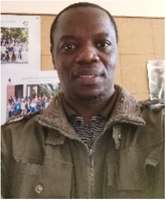

---
layout: page
title: Course Facilitators 
--- 

<h4 style="color:DodgerBlue;"> Prof. Wafaie W. Fawzi, Lead Facilitator and Principal Investigator, Harvard School of Public Health, USA </h4> 
Professor of Population Sciences, and Professor of Nutrition, Epidemiology, and Global Health.  
Email: <a href="mailto:mina@hsph.harvard.edu">mina@hsph.harvard.edu</a>  

  Wafaie Fawzi’s research has generated significant new knowledge on the discovery and translation of interventions to enhance maternal and child health and human development, with emphasis on nutritional factors. His research includes the epidemiology of adverse pregnancy outcomes, childhood infections, and HIV, TB and malaria. He established the Nutrition and Global Health Program at Harvard T.H. Chan School of Public Health, that addresses and documents existing gaps; advances the research agenda; and convenes multi-disciplinary partners. He also developed two implementation science initiatives to advance adolescent health in Africa and Asia, and the intersectoral integration of agriculture, nutrition and health in Ethiopia and Tanzania. He established the Africa Research, Implementation Science, and Education (ARISE) Network, a partnership of leading academic institutions in Africa, and the China Harvard Africa Network (CHAN) to advance cutting-edge training of public health leaders through South-South-North institutional partnerships.  Visit <a href="https://www.hsph.harvard.edu/wafaie-fawzi/">Prof. Wafaie's website</a> for more information about his work. 
  

<h4 style="color:DodgerBlue;"> Prof. Ina Danquah, Lead Facilitator   </h4>
Robert Bosch Junior Professor for Sustainable Nutrition in sub-Saharan Africa, Heidelberg Institute of Global Health, Germany.  
Email: <a href="mailto:ina.danquah@uni-heidelberg.de">ina.danquah@uni-heidelberg.de</a>  

  Ina has trained in nutrition science and epidemiology and has obtained her PhD in Tropical Medicine from Charité – Universitaetsmedizin Berlin, Germany. She has strong research interests in dietary risk factors for infectious diseases, obesity and type 2 diabetes, particularly among African populations under transition. Ina leads a research group on climate change, nutrition and health with the ambition i) to define impacts on dietary habits and nutritional status, ii) to design, implement and evaluate climate change adaptation strategies, and iii) to determine the health co-benefits of climate change mitigation actions. Ina coordinates a large consortium on climate change and health in sub-Saharan Africa, and is Robert Bosch Junior Professor for Sustainable Nutrition in sub-Saharan Africa. She has published more than 90 peer-reviewed articles, has an h-index of 23 and an i10-index of 45. Her work has been cited more than 2100 times.  Visit <a href="https://www.klinikum.uni-heidelberg.de/en/personen/jun-prof-pd-dr-ina-danquah-7580">Prof. Danquah's website</a> for more information about his work. 
  

<h4 style="color:DodgerBlue;"> Prof. John Odindi, Lead Facilitator   </h4>
Professor, School of Agricultural, Earth and Environmental Sciences, University of KwaZulu-Natal, South Africa.  
Email: <a href="mailto:odindij@ukzn.ac.za">odindij@ukzn.ac.za</a>  

  John Odindi is a professor of terrestrial remote sensing within the School of Agricultural, Earth and Environmental Sciences at the University of KwaZulu-Natal. His expertise are in vegetation pattern and condition analysis in the face of local and global change using remotely sensed datasets and approaches. He integrates ecology, biodiversity conservation and Remote sensing to model the impact of landscape transformation and invasive species on ecosystems. He is also interested in understanding the implication of urban green spaces on urban thermal micro- and macro climate in the face of climate change using optical and thermal remotely sensed data. His specific areas of interest include land use and land cover change, hyperspectral- and multi- spectral Remote Sensing of vegetation, urban green ecology in a changing global climate, quantification of urban ecosystem services using remotely sensed data and precision farming using hyper and multi-spectral data from aerial and satellite platforms.  Visit <a href="https://saees.ukzn.ac.za/John-Odindi/ ">Prof. Odindi's website</a> for more information about his work. 
  

<h4 style="color:DodgerBlue;"> Prof. Onisimo Mutanga, Lead Facilitator </h4>
Professor and SARChl Chair on Landuse Planning and Management in the School of Agriculture, Earth and Environmental Science, University of KwaZulu-Natal, South Africa.  
Email: <a href="mailto:mutangao@ukzn.ac.za">mutangao@ukzn.ac.za</a>  

  Onisimo Mutanga is full Professor of Remote Sensing and SARChI Chair in Landuse Planning and Management in the School of Agriculture, Earth and Environmental Science at the University of KwaZulu- Natal. His expertise lies in resource modelling, and pattern and condition analysis in the face of global and land use change. These include vegetation quality and quantity assessment in both space and time using remote sensing for grazing resource management and climate change mitigation. He integrates ecology, biodiversity conservation and remote sensing to model, among others, the impact of forest fragmentation, pests and diseases and invasive species on ecosystems as an integral component of land use planning and management.  Visit <a href=" https://saees.ukzn.ac.za/onisimo-mutanga/"> Prof. Mutanga's website</a> for more information about his work. 
  

<h4 style="color:DodgerBlue;"> Dr. Sandra Barteit, Facilitator, Training Director HIGH </h4> 
Email: <a href="mailto:barteit@uni-heidelberg.de">barteit@uni-heidelberg.de</a>  

  Research Group Leader for Digital Global Health Heidelberg Institute of Global Health, Germany.    Visit <a href="https://www.klinikum.uni-heidelberg.de/index.php?id=143349&no_cache=1&type=98">Dr. Barteit's website </a> for more information about her work. 
   

<h4 style="color:DodgerBlue;"> Dr. Bernd Franke, Facilitator </h4> 

  Scientific Director Institute for Energy and Environmental Research (IFEU).    Visit <a href="https://www.ifeu.de/en/staff/detail/bernd-franke">Dr. Franke's website</a> for more information about her work. 
  

<h4 style="color:DodgerBlue;"> Dr. Fred Hattermann, Facilitator </h4> 

  SDeputy Head, Research Department (Climate Resilience) Potsdam Institute for Climate Impact Research.    Visit <a href="https://www.pik-potsdam.de/members/fred">Dr. Hattermann's website</a> for more information about her work. 
  

<h4 style="color:DodgerBlue;"> Dr. Irmgard Jordan, Facilitator </h4> 

  Human Nutrition and Home Economic Scientist – CIM Expert Alliance Bioversity & CIAT.    Visit <a href="https://alliancebioversityciat.org/who-we-are/irmgard-jordan">Dr. Jordan's website</a> for more information about her work. 
  

<h4 style="color:DodgerBlue;"> Dr. Isabel Madzorera, Facilitator </h4> 

  Assistant Professor in Public Health Nutrition, University of California, Berkeley.    Visit <a href="https://publichealth.berkeley.edu/people/isabel-madzorera/">Dr. Madzorera's website</a> for more information about her work. 
  

<h4 style="color:DodgerBlue;"> Dr. Gabriel Kallah-Dagadu, Facilitator </h4> 

  WASHU Takwimu Postdoctoral Fellow,  University of KwaZulu-Natal.  
  

<h4 style="color:DodgerBlue;"> Dr. Isabel Mank, Facilitator </h4> 

  Evaluator, German Institute for Development Evaluation,
  Germany    Visit <a href="https://www.deval.org/en/about-us/who-we-are/team/isabel-mank">Dr. Madzorera's website</a> for more information about her work. 
  

<h4 style="color:DodgerBlue;"> Dr. Trylee Matongera, Facilitator </h4> 

  Postdoctoral Research Fellow at the Centre for Transformative Agriculture and Food Systems,   University of KwaZulu-Natal.  
  

### Course Facilitators

<table class="tg">
<thead>
  <tr>
    <th class="tg-amwm">Role</th>
    <th class="tg-amwm">Name</th>
    <th class="tg-amwm">Email</th>
    <th class="tg-amwm">Brief Bio</th>
    <th class="tg-amwm"></th>
  </tr>
</thead>
<tbody>
  <tr>
    <td class="tg-0lax">Lead Facilitator </td>
    <td class="tg-0lax">Prof.  Wafaie Fawzi,
Professor of Population Sciences, and Professor of Nutrition, Epidemiology, and Global Health, PI HSPH</td>
    <td class="tg-0lax"><a href="mailto:mina@hsph.harvard.edu"> mina@hsph.harvard.edu</a> </td>
    <td class="tg-0lax"> Wafaie Fawzi’s research has generated significant new knowledge on the discovery and translation of interventions to enhance maternal and child health and human development, with emphasis on nutritional factors. His research includes the epidemiology of adverse pregnancy outcomes, childhood infections, and HIV, TB and malaria. He established the Nutrition and Global Health Program at Harvard T.H. Chan School of Public Health, that addresses and documents existing gaps; advances the research agenda; and convenes multi-disciplinary partners. He also developed two implementation science initiatives to advance adolescent health in Africa and Asia, and the intersectoral integration of agriculture, nutrition and health in Ethiopia and Tanzania. He established the Africa Research, Implementation Science, and Education (ARISE) Network, a partnership of leading academic institutions in Africa, and the China Harvard Africa Network (CHAN) to advance cutting-edge training of public health leaders through South-South-North institutional partnerships.
 </td>
    <td class="tg-0lax"></td>
  </tr>
  <tr>
    <td class="tg-0lax">Lead Facilitator</td>
    <td class="tg-0lax">Prof. Ina Danquah, Heidelberg Institute of Global Health </td>
    <td class="tg-0lax"><a href="mailto:ina.danquah@uni-heidelberg.de">ina.danquah@uni-heidelberg.de</a> </td>
    <td class="tg-0lax">Ina has trained in nutrition science and epidemiology and has obtained her PhD in Tropical Medicine from Charité – Universitaetsmedizin Berlin, Germany. She has strong research interests in dietary risk factors for infectious diseases, obesity and type 2 diabetes, particularly among African populations under transition. Ina leads a research group on climate change, nutrition and health with the ambition i) to define impacts on dietary habits and nutritional status, ii) to design, implement and evaluate climate change adaptation strategies, and iii) to determine the health co-benefits of climate change mitigation actions. Ina coordinates a large consortium on climate change and health in sub-Saharan Africa, and is Robert Bosch Junior Professor for Sustainable Nutrition in sub-Saharan Africa. She has published more than 90 peer-reviewed articles, has an h-index of 23 and an i10-index of 45. Her work has been cited more than 2100 times.</td>
    <td class="tg-0lax"></td>
  </tr>
  <tr>
    <td class="tg-0lax">Lead Facilitator</td>
    <td class="tg-0lax">Prof. John Odindi, University of KwaZulu-Natal</td>
    <td class="tg-0lax"><a href="mailto:odindij@ukzn.ac.za">odindij@ukzn.ac.za</a> </td>
    <td class="tg-0lax">John Odindi is a professor of terrestrial remote sensing within the School of Agricultural, Earth and Environmental Sciences at the University of KwaZulu-Natal. His expertise are in vegetation pattern and condition analysis in the face of local and global change using remotely sensed datasets and approaches. He integrates ecology, biodiversity conservation and Remote sensing to model the impact of landscape transformation and invasive species on ecosystems. He is also interested in understanding the implication of urban green spaces on urban thermal micro- and macro climate in the face of climate change using optical and thermal remotely sensed data. His specific areas of interest include land use and land cover change, hyperspectral- and multi- spectral Remote Sensing of vegetation, urban green ecology in a changing global climate, quantification of urban ecosystem services using remotely sensed data and precision farming using hyper and multi-spectral data from aerial and satellite platforms.</td>
    <td class="tg-0lax"></td>
  </tr>
  <tr>
    <td class="tg-0lax">Lead Facilitator</td>
    <td class="tg-0lax">Prof. Onisimo Mutanga, University of KwaZulu-Natal</td>
    <td class="tg-0lax"><a href="mailto:mutangao@ukzn.ac.za">mutangao@ukzn.ac.za</a> </td>
    <td class="tg-0lax">Onisimo Mutanga is full Professor of Remote Sensing and SARChI Chair in Landuse Planning and Management in the School of Agriculture, Earth and Environmental Science at the University of KwaZulu- Natal. His expertise lies in resource modelling, and pattern and condition analysis in the face of global and land use change. These include vegetation quality and quantity assessment in both space and time using remote sensing for grazing resource management and climate change mitigation. He integrates ecology, biodiversity conservation and remote sensing to model, among others, the impact of forest fragmentation, pests and diseases and invasive species on ecosystems as an integral component of land use planning and management.</td>
    <td class="tg-0lax"></td>
  </tr>
   <tr>
    <td class="tg-0lax">Facilitator</td>
    <td class="tg-0lax">Dr. Isabel Madzorera </td>
    <td class="tg-0lax"><a href="mailto:imadzorera@berkeley.edu">imadzorera@berkeley.edu</a> </td>
    <td class="tg-0lax">Dr. Isabel Madzorera is an Assistant Professor in Public Health Nutrition at the University of California, Berkeley, in the division of Community Health Sciences. Dr. Madzorera is a nutrition epidemiologist with interests in the intersection of food systems, nutrition and sustainable diets in low- and middle-income countries (LMICs). The goals of her research program are to utilize advanced nutrition epidemiologic methods to assess diet quality as a key modifiable risk factor for poor maternal and child health outcomes in LMICs, and to identify the role of food systems and other contributing factors to the triple burden of malnutrition in these contexts. Dr. Madzorera has led global health research focusing on the evaluation of food systems and diet quality, and their influence on maternal and child health.  Her previous research has included evaluating the role of maternal diet quality during pregnancy and its impacts on the risk of low birth weight, small for gestational age and preterm births, and also assessing the effect of COVID-19 on food prices and diets. Dr. Madzorera has extensive field-based experience including leading maternal and child nutrition interventions in sub-Saharan Africa. She has spent considerable time working in Zimbabwe, Zambia, Malawi, and Mozambique and conducted research in Tanzania and Ethiopia. Dr. Madzorera has an ScD in Nutritional Epidemiology from the Harvard School of Public Health. 
 </td>
    <td class="tg-0lax"></td>
  </tr>
   <tr>
    <td class="tg-0lax">Facilitator</td>
    <td class="tg-0lax">Dr. Trylee Matongera </td>
    <td class="tg-0lax"><a href="mailto:matongerat@ukzn.ac.za">matongerat@ukzn.ac.za</a> </td>
    <td class="tg-0lax">Trylee Matongera is a Postdoctoral Research Fellow at the Centre for Transformative Agriculture and Food Systems at the University of KwaZulu-Natal. His research interests lie in applying advanced machine learning and remote sensing techniques to better understand crop growth patterns and to develop more effective and efficient precision agriculture technologies. Specifically, he is interested in exploring the use of hyperspectral, LIDAR and multispectral imagery to detect and monitor crop health and nutrient deficiencies, as well as the use of unmanned aerial vehicles (UAVs) for precision mapping and monitoring of crops and agricultural fields. </td>
    <td class="tg-0lax"></td>
  </tr>
  
  <tr>
    <td class="tg-0lax">Teaching Assistant</td>
    <td class="tg-0lax">Dr. Gabriel Kallah-Dagadu, DSI postdoc</td>
    <td class="tg-0lax"><a href="mailto:kallahdagadug@ukzn.ac.za">kallahdagadug@ukzn.ac.za</a> </td>
    <td class="tg-0lax"> Gabriel Kallah-Dagadu is a Postdoctoral Fellow for the DSI-Africa Training program on Health Data Science project hosted at the University of KwaZulu-Natal, South Africa, and the other two partner institutions: Harvard T. H. Chan School of Public Health, USA, and Heidelberg Institute of Global Health, Germany. Gabriel is a faculty member (Senior Lecturer) at the Department of Statistics and Actuarial Science, University of Ghana. Gabriel holds a Ph.D. in Statistics from the University of Cape Coast, Ghana.  His research interest are centered on applied probability, computational statistics, and machine learning with real-life applications to health, nutrition, climate change, and finance. He has published scientific and peer-reviewed articles in local and international journals.</td>
    <td class="tg-0lax"></td>
  </tr>
  
</tbody>
</table>

