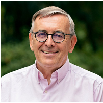
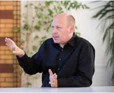
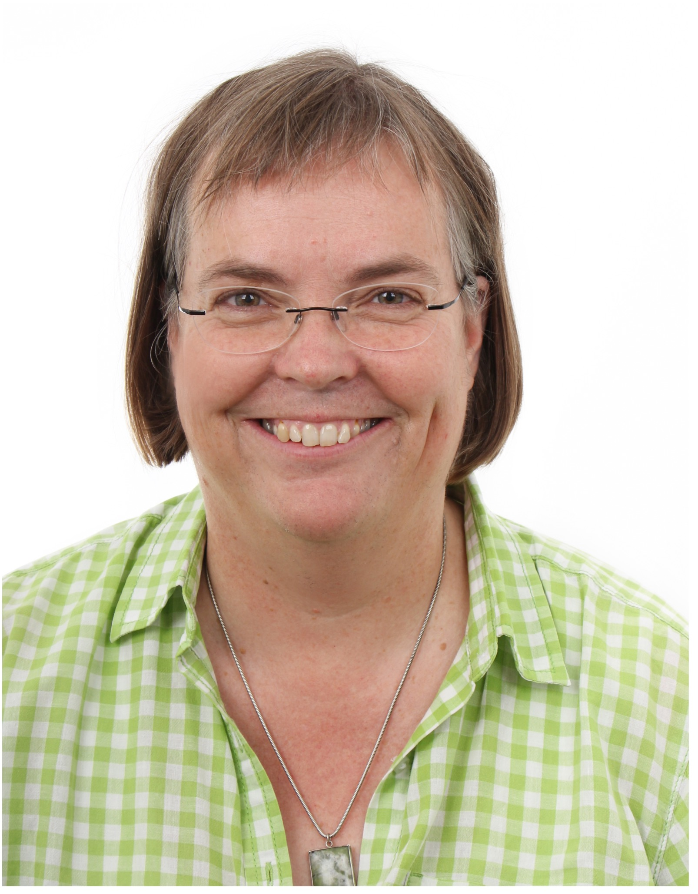
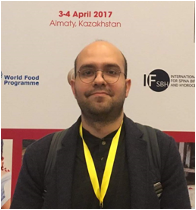
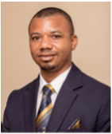
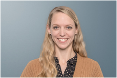
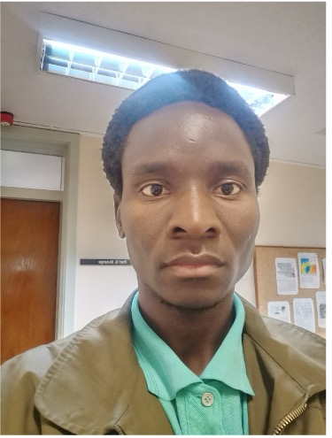
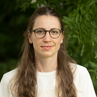

---
layout: page
title: Participants 
--- 

<h4 style="color:DodgerBlue;"> William Nelson Mwakalasya, Lecturer/Academic Staff, Muhimbili University of Health and Allied Sciences, Tanzanian  </h4> 
Email: <a href="mailto:wnmwakalasya@gmail.com">wnmwakalasya@gmail.com</a>  

   
   I'm Environmental Health Practitioner based on environmental and occupational toxicology. My mission is to uncover the role of the ever-changing environment in the epidemiology of diseases. My current focus is on understanding how the agriculture sector affects the health of those working there.    
  Research Interest: occupational toxicology; climate change; environmental toxicology 
   
  
 
 
 
 
<h4 style="color:DodgerBlue;"> Dr. Bernd Franke, Facilitator </h4>

  
   Scientific Director Institute for Energy and Environmental Research (IFEU).    Visit <a href="https://www.ifeu.de/en/staff/detail/bernd-franke">  Dr. Franke's website  </a> for more information about her work. 
  
 
 
 
 

<h4 style="color:DodgerBlue;"> Dr. Fred Hattermann, Facilitator </h4> 

  SDeputy Head, Research Department (Climate Resilience) Potsdam Institute for Climate Impact Research.    Visit <a href="https://www.pik-potsdam.de/members/fred">Dr. Hattermann's website</a> for more information about her work. 
  
 
 
 
 
<h4 style="color:DodgerBlue;"> Dr. Irmgard Jordan, Facilitator </h4> 

  Human Nutrition and Home Economic Scientist – CIM Expert Alliance Bioversity & CIAT.    Visit <a href="https://alliancebioversityciat.org/who-we-are/irmgard-jordan">Dr. Jordan's website</a> for more information about her work. 
  
 
 
 
 
<h4 style="color:DodgerBlue;"> Dr. Sabri Bromage, Facilitator </h4> 

  Researcher, Institute of Nutrition, Mahidol University and 
Research Associate,  Department of Nutrition, Harvard T.H. Chan School of Public Health.    Visit <a href="https://scholar.harvard.edu/sabri">Dr. Bromage's website</a> for more information about her work. 
  
 
 
 
 

<h4 style="color:DodgerBlue;"> Dr. Gabriel Kallah-Dagadu, Facilitator </h4> 

  WASHU Takwimu Postdoctoral Fellow,  University of KwaZulu-Natal.  
  
 
 
 
 

<h4 style="color:DodgerBlue;"> Dr. Isabel Mank, Facilitator </h4> 

  Evaluator, German Institute for Development Evaluation,
  Germany    Visit <a href="https://www.deval.org/en/about-us/who-we-are/team/isabel-mank">Dr. Mank's website</a> for more information about her work. 
  
  
 
 
 

<h4 style="color:DodgerBlue;"> Dr. Trylee Matongera, Facilitator </h4> 

  Postdoctoral Research Fellow at the Centre for Transformative Agriculture and Food Systems,   University of KwaZulu-Natal.  
  
 
 
 
 
<h4 style="color:DodgerBlue;"> Dr. Mthembeni Mngadi, Facilitator </h4> 

  Postdoctoral Research Fellow at the Institute of Commercial Forest Research,   University of KwaZulu-Natal.  
  
 
 
 
 
<h4 style="color:DodgerBlue;"> Dr. Michael Opata, Facilitator </h4> 

  Postdoctoral Research Fellow at the Theoretical and Computational Chemistry Group,   Heidelberg University, Germany.  
  
 
 
 
 

<h4 style="color:DodgerBlue;"> Dr. Christin Zeitz, Facilitator </h4> 

  Institute for Energy and Environmental Research (IFEU),
  Germany    Visit <a href="https://www.ifeu.de/en/staff/detail/christin-zeitz/">Dr. Zeitz's website</a> for more information about her work. 
  

