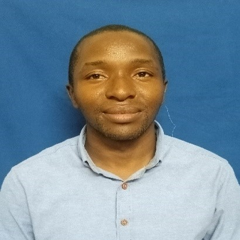

---
layout: page
title: Participants 
--- 

<h4 style="color:DodgerBlue;"> William Nelson Mwakalasya  Lecturer/Academic Staff, Muhimbili University of Health and Allied Sciences, Tanzanian  </h4> 
Email: <a href="mailto:wnmwakalasya@gmail.com">wnmwakalasya@gmail.com</a>  

   
   I'm Environmental Health Practitioner based on environmental and occupational toxicology. My mission is to uncover the role of the ever-changing environment in the epidemiology of diseases. My current focus is on understanding how the agriculture sector affects the health of those working there.    
 <b>Research Interest:</b> Occupational toxicology; climate change; environmental toxicology 
   
  
 
<h4 style="color:DodgerBlue;"> Hawah Nabajja   Lecturer, Makerere University, Uganda </h4> 
Email: <a href="mailto:hnabajja@gmail.com">hnabajja@gmail.com</a>  

   
   Hawah is influential and adaptable to both managerial and statistical contexts, with more than three years of experience in managerial work, data collection, management, analysis, research and presentation. Hawah has proven competencies in strategic thinking and analysis, supervision management and data presentation. Having completed her master's degree in Biostatistics, she successfully started a teaching career at Makerere University Business School specializing in Quantitative methods. 
Hawah has been successful in community resilience programmes and leading research teams for both short-term and long-term research projects for different organizations e.g. Infectious Disease Institute (IDI)School of Public Health Makerere University, The Aids Support Organization (TASO) and Infectious Disease Institute (IDI).    
 <b>Research Interest:</b> Machine Learning; Non Communicable ; Climate Change 
   
  
<h4 style="color:DodgerBlue;"> Samuel Oluwafemi Oyamakin   Lecturer, University of Ibadan and University of Ibadan Research Foundation, Nigeria  </h4> 
Email: <a href="mailto:fm_oyamakin@yahoo.com">fm_oyamakin@yahoo.com</a>  

   
   My name is Samuel Oluwafemi Oyamakin, and I hold bachelor's, master's, and Ph.D. degrees in Statistics from the University of Ibadan, where I currently work as a Senior Lecturer and a Senior Research Fellow at the University of Ibadan Research Foundation. My research areas are Biostatistics, Forest biometrics, and Health Data Science.    
 <b>Research Interest:</b> Biostatistics; Climate change; Data science and Forest Biometrics. 
   
 
 
<h4 style="color:DodgerBlue;"> Damilare Babatunde   Postgraduate Student, University of South Africa, South Africa  </h4> 
Email: <a href="mailto:damilarebabatunde21@gmail.com">damilarebabatunde21@gmail.com </a>  

   
   As a dedicated PhD student, Damilare delves into the fascinating realms of molecular modelling. With a passion for scientific inquiry and a commitment to unravelling complex phenomena, Damilare aims to contribute to the advancement of knowledge in drug discovery and energy production through rigorous research and analytical thinking.     
 <b>Research Interest:</b> Computational Chemistry; Energy Production; Protein-Ligand Interactions. 
   
  
 
 
<h4 style="color:DodgerBlue;"> Enoch Sakyi-Yeboah   Lecturer, University of Ghana, Ghana </h4> 
Email: <a href="mailto:esyeboah@ug.edu.gh">esyeboah@ug.edu.gh </a>  

   
   I am a statistician and work as a Lecturer at the Department of Statistics and Actuarial Science,  University of Ghana.     
 <b>Research Interest:</b> Machine learning; Probability; Climate change. 
   
 
 

<h4 style="color:DodgerBlue;"> Pankras Luoga   Lecturer, Muhimbili University of Health and Allied Sciences, Tanzania </h4> 
Email: <a href="mailto:luoga.pankras1@gmail.com">luoga.pankras1@gmail.com </a>  

   
   Five years experience managing primary Health Systems in Tanzania and three years as an academician teaching management, leadership, Monitoring and evaluation in Health. My research interests include project management, primary health systems, implementation science, monitoring and evaluation, and writing articles on various general and specific health topics in local Newspapers.    
 <b>Research Interest:</b>  primary health systems management; implementation science; monitoring and evaluation. 
   
  
 
 
<h4 style="color:DodgerBlue;"> Esther Nhang'ano    Lecturer, Muhimbili University of Health and Allied Sciences - MUHAS, Tanzania </h4> 
Email: <a href="mailto:mlawaesther@gmail.com ">mlawaesther@gmail.com </a>  

   
   Esther Nhang’ano is an Academician at MUHAS, Tanzania teaching various topics including water and sanitation, food safety and hygiene, and climate change. Before joining MUHAS she worked with Dar es Salaam City Council for 15 years around IPC/WASH. Her research interests address the area of WASH, IPC, climate change, food safety & hygiene.    
 <b>Research Interest:</b> Water, sanitation and hygiene; climate change; Infection prevention and control. 
   
  
 
 

<h4 style="color:DodgerBlue;"> Sylvestre Mbanza    Lecturer, University of Tourism, Technology and Business Studies (UTB-Rwanda), Rwanda </h4> 
Email: <a href="mailto:smbanza@gmail.com"> smbanza@gmail.com </a>  

     Rwandan and currently working as a lecturer at the University of Tourism, Technology and Business Studies in Rwanda since 2016. Completed a master's degree in Food Security at the University of KwaZulu-Natal, and PhD degree in Health Science at AZTECA University.    
 <b>Research Interest:</b> Food security and nutrition. 
   
 
 

<h4 style="color:DodgerBlue;"> Insaaf Rashid   Undergraduate Student, University of KwaZulu Natal, South Africa </h4> 
Email: <a href="mailto:insaafrashid78660@gmail.com"> insaafrashid78660@gmail.com </a>  

     My name is Insaaf Rashid and I am a final year Bachelor of Commerce student at the University of KwaZulu Natal, majoring in Information Systems and Technology and Supply Chain Management. While I am passionate about leveraging technology and optimizing logistics, I aspire to make a positive impact in the business world through innovative solutions. I have a keen interest in data science and its application in environmental issues, particularly in the field of Supply Chain management.    
 <b>Research Interest:</b> Sustainability; Data Science; Machine Learning. 
   
 
 

<h4 style="color:DodgerBlue;"> Mary Amenudzi   Research Fellow, Kwame Nkrumah University of Science and Technology, Ghana </h4> 
Email: <a href="mailto:ewhuraharmah@gmail.com"> ewhuraharmah@gmail.com </a>  

     I recently graduated with a Bachelor's Degree in Biological Sciences. I have a strong interest in Microbiology and I'm interested in continuing my education with a Masters Degree in Biological Sciences. I have always had a passion to solve problems specifically health issues, which has brought me this far further into Biostatistics.    
 <b>Research Interest:</b> Microbiology; infectious disease; biostatistics. 
   
 
 

<h4 style="color:DodgerBlue;"> Yao Etienne KOUAKOU   Lecturer, NANGUI ABROGOUA UNIVERSITY, Abidjan, Côte d'Ivoire </h4> 
Email: <a href="mailto:etienne.kouakou@csrs.ci"> etienne.kouakou@csrs.ci </a>  

     I am a Researcher in the Geosciences and Environment Laboratory at NANGUI ABROGOUA University, Abidjan, Ivory Coast. I have a PhD in Hydrology, Hydrogeology and Environment and a Master's degree in Geomatics. Postdoctoral researcher in the HE2AT Center project, my research focuses on the application of GIS and remote sensing to climate change, water resources and health.    
 <b>Research Interest:</b> Water ressources; Climate change; geographycal information system. 
   
 
 

